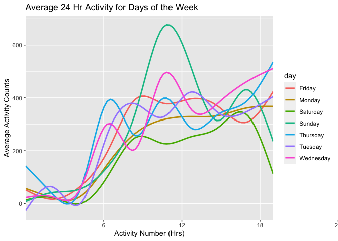

HW3, Onyeka Isamah
================

``` r
library(tidyverse)
```

    ## ── Attaching packages ─────────────────────────────────────── tidyverse 1.3.1 ──

    ## ✓ ggplot2 3.3.5     ✓ purrr   0.3.4
    ## ✓ tibble  3.1.4     ✓ dplyr   1.0.7
    ## ✓ tidyr   1.1.3     ✓ stringr 1.4.0
    ## ✓ readr   2.0.1     ✓ forcats 0.5.1

    ## ── Conflicts ────────────────────────────────────────── tidyverse_conflicts() ──
    ## x dplyr::filter() masks stats::filter()
    ## x dplyr::lag()    masks stats::lag()

``` r
library(p8105.datasets)
```

# Problem 1:

The data set instacart has 1384617 rows and 15 columns which include
`order_id`, `product_id`, `add_to_cart_order`, `reordered user_id`,
`eval_set`, `order_number`, `order_dow`, `order_hour_of_day`,
`days_since_prior_order`, `product_name`, `aisle_id`, `department_id`,
`aisle`, and `departmemt`. There are 134 aisles, the three top aisles
that most products are order from include fresh fruits aisle (18726
bananas, ranked \#1 in fresh fruit category), the packaged vegetable
fruits aisle(Organic Baby Spiniach n = 9784 and ranked as \#1 product
within that aisle) and the milk aisle (organic whole milk n=4908).

``` r
data("instacart")
janitor::clean_names(instacart)
```

    ## # A tibble: 1,384,617 × 15
    ##    order_id product_id add_to_cart_order reordered user_id eval_set order_number
    ##       <int>      <int>             <int>     <int>   <int> <chr>           <int>
    ##  1        1      49302                 1         1  112108 train               4
    ##  2        1      11109                 2         1  112108 train               4
    ##  3        1      10246                 3         0  112108 train               4
    ##  4        1      49683                 4         0  112108 train               4
    ##  5        1      43633                 5         1  112108 train               4
    ##  6        1      13176                 6         0  112108 train               4
    ##  7        1      47209                 7         0  112108 train               4
    ##  8        1      22035                 8         1  112108 train               4
    ##  9       36      39612                 1         0   79431 train              23
    ## 10       36      19660                 2         1   79431 train              23
    ## # … with 1,384,607 more rows, and 8 more variables: order_dow <int>,
    ## #   order_hour_of_day <int>, days_since_prior_order <int>, product_name <chr>,
    ## #   aisle_id <int>, department_id <int>, aisle <chr>, department <chr>

``` r
max(instacart$aisle_id)
```

    ## [1] 134

``` r
top_products_by_aisle_df= instacart %>% select(
         everything()) %>% 
  group_by(aisle, department) %>% 
  count(
    product_name, name = "product_count") %>% 
  mutate(product_rank = min_rank(desc(product_count)))%>% 
 
   filter(product_rank <= 3)  %>% 
  arrange(product_rank) %>% arrange(desc(product_count)) 


top_products_by_aisle_df
```

    ## # A tibble: 406 × 5
    ## # Groups:   aisle, department [134]
    ##    aisle                      department product_name product_count product_rank
    ##    <chr>                      <chr>      <chr>                <int>        <int>
    ##  1 fresh fruits               produce    Banana               18726            1
    ##  2 fresh fruits               produce    Bag of Orga…         15480            2
    ##  3 fresh fruits               produce    Organic Str…         10894            3
    ##  4 packaged vegetables fruits produce    Organic Bab…          9784            1
    ##  5 packaged vegetables fruits produce    Organic Ras…          5546            2
    ##  6 packaged vegetables fruits produce    Organic Blu…          4966            3
    ##  7 milk                       dairy eggs Organic Who…          4908            1
    ##  8 fresh vegetables           produce    Organic Cuc…          4613            1
    ##  9 fresh vegetables           produce    Organic Zuc…          4589            2
    ## 10 fresh vegetables           produce    Organic Yel…          4290            3
    ## # … with 396 more rows

Plotting top products by aisle where product count &gt; 10000

``` r
top_products_by_aisle_df %>% 
filter(product_count >= 10000) %>% 
  ggplot(aes(x= product_name, y=product_count)) + geom_point(aes(color= aisle))
```

<!-- -->

Table showing the three most popular items in each of the aisles “baking
ingredients”, “dog food care”, and “packaged vegetables fruits”.

``` r
pop3_df= (select(
  instacart, order_number, aisle,product_name) %>% 
  filter(aisle %in% c("baking ingredients", "dog food care", "packaged vegetables fruits")) %>% 
  
  group_by(aisle) %>% 
  count(
    product_name, name = "product_count") %>% 
    
  mutate(product_rank = min_rank(desc(product_count))) %>% 
    
   filter(product_rank <= 3)  %>% 
    
  arrange(product_rank) %>% arrange(desc(product_count)))

pop3_df
```

    ## # A tibble: 9 × 4
    ## # Groups:   aisle [3]
    ##   aisle                      product_name             product_count product_rank
    ##   <chr>                      <chr>                            <int>        <int>
    ## 1 packaged vegetables fruits Organic Baby Spinach              9784            1
    ## 2 packaged vegetables fruits Organic Raspberries               5546            2
    ## 3 packaged vegetables fruits Organic Blueberries               4966            3
    ## 4 baking ingredients         Light Brown Sugar                  499            1
    ## 5 baking ingredients         Pure Baking Soda                   387            2
    ## 6 baking ingredients         Cane Sugar                         336            3
    ## 7 dog food care              Snack Sticks Chicken & …            30            1
    ## 8 dog food care              Organix Chicken & Brown…            28            2
    ## 9 dog food care              Small Dog Biscuits                  26            3

Make a table showing the mean hour of the day at which Pink Lady Apples
and Coffee Ice Cream are ordered on each day of the week; format this
table for human readers (i.e. produce a 2 x 7 table).

``` r
mean_hod = instacart %>% drop_na() %>% 
  select(product_name,order_hour_of_day, order_dow)  %>% 
 mutate(
    
    order_dow = 
      recode_factor(order_dow,
        "0" = "Sunday", "1" = "Monday", "2" = "Tuesday", "3" = "Wednesday", "4"= "Thursday", "5" = "Friday", "6" = "Saturday")) %>% 
  group_by(product_name, order_dow) %>% 
  summarise(meanhour = mean(order_hour_of_day)) %>% 
filter(product_name %in% c( "Pink Lady Apples", "Coffee Ice Cream")) %>% 
  pivot_wider(names_from = order_dow,  values_from = meanhour) 
```

    ## `summarise()` has grouped output by 'product_name'. You can override using the `.groups` argument.

``` r
mean_hod
```

    ## # A tibble: 2 × 8
    ## # Groups:   product_name [2]
    ##   product_name     Sunday Monday Tuesday Wednesday Thursday Friday Saturday
    ##   <chr>             <dbl>  <dbl>   <dbl>     <dbl>    <dbl>  <dbl>    <dbl>
    ## 1 Coffee Ice Cream   13.8   14.3    15.4      15.3     15.2   12.3     13.8
    ## 2 Pink Lady Apples   13.4   11.4    11.7      14.2     11.6   12.8     11.9

\#Problem 2

``` r
library(p8105.datasets)
data("brfss_smart2010")

brfss_smart2010
```

    ## # A tibble: 134,203 × 23
    ##     Year Locationabbr Locationdesc  Class  Topic Question   Response Sample_Size
    ##    <int> <chr>        <chr>         <chr>  <chr> <chr>      <chr>          <int>
    ##  1  2010 AL           AL - Jeffers… Healt… Over… How is yo… Excelle…          94
    ##  2  2010 AL           AL - Jeffers… Healt… Over… How is yo… Very go…         148
    ##  3  2010 AL           AL - Jeffers… Healt… Over… How is yo… Good             208
    ##  4  2010 AL           AL - Jeffers… Healt… Over… How is yo… Fair             107
    ##  5  2010 AL           AL - Jeffers… Healt… Over… How is yo… Poor              45
    ##  6  2010 AL           AL - Jeffers… Healt… Fair… Health St… Good or…         450
    ##  7  2010 AL           AL - Jeffers… Healt… Fair… Health St… Fair or…         152
    ##  8  2010 AL           AL - Jeffers… Healt… Heal… Do you ha… Yes              524
    ##  9  2010 AL           AL - Jeffers… Healt… Heal… Do you ha… No                77
    ## 10  2010 AL           AL - Jeffers… Healt… Unde… Adults ag… Yes              316
    ## # … with 134,193 more rows, and 15 more variables: Data_value <dbl>,
    ## #   Confidence_limit_Low <dbl>, Confidence_limit_High <dbl>,
    ## #   Display_order <int>, Data_value_unit <chr>, Data_value_type <chr>,
    ## #   Data_Value_Footnote_Symbol <chr>, Data_Value_Footnote <chr>,
    ## #   DataSource <chr>, ClassId <chr>, TopicId <chr>, LocationID <chr>,
    ## #   QuestionID <chr>, RESPID <chr>, GeoLocation <chr>

``` r
newbrfss_df <- brfss_smart2010 %>% separate(Locationdesc,into = c ("state", "County")) %>% 
select(Response, Topic, everything()) %>% 
  mutate(Response = factor(Response, levels = c("Poor", "Fair", "Good", "Very good", "Excellent"))) %>% 
  filter(Topic == "Overall Health") %>% janitor::clean_names() 
```

    ## Warning: Expected 2 pieces. Additional pieces discarded in 134203 rows [1, 2, 3,
    ## 4, 5, 6, 7, 8, 9, 10, 11, 12, 13, 14, 15, 16, 17, 18, 19, 20, ...].

``` r
newbrfss_df
```

    ## # A tibble: 10,625 × 24
    ##    response  topic           year locationabbr state county class question sample_size
    ##    <fct>     <chr>          <int> <chr>        <chr> <chr>  <chr> <chr>          <int>
    ##  1 Excellent Overall Health  2010 AL           AL    Jeffe… Heal… How is …          94
    ##  2 Very good Overall Health  2010 AL           AL    Jeffe… Heal… How is …         148
    ##  3 Good      Overall Health  2010 AL           AL    Jeffe… Heal… How is …         208
    ##  4 Fair      Overall Health  2010 AL           AL    Jeffe… Heal… How is …         107
    ##  5 Poor      Overall Health  2010 AL           AL    Jeffe… Heal… How is …          45
    ##  6 Excellent Overall Health  2010 AL           AL    Mobile Heal… How is …          91
    ##  7 Very good Overall Health  2010 AL           AL    Mobile Heal… How is …         177
    ##  8 Good      Overall Health  2010 AL           AL    Mobile Heal… How is …         224
    ##  9 Fair      Overall Health  2010 AL           AL    Mobile Heal… How is …         120
    ## 10 Poor      Overall Health  2010 AL           AL    Mobile Heal… How is …          66
    ## # … with 10,615 more rows, and 15 more variables: data_value <dbl>,
    ## #   confidence_limit_low <dbl>, confidence_limit_high <dbl>,
    ## #   display_order <int>, data_value_unit <chr>, data_value_type <chr>,
    ## #   data_value_footnote_symbol <chr>, data_value_footnote <chr>,
    ## #   data_source <chr>, class_id <chr>, topic_id <chr>, location_id <chr>,
    ## #   question_id <chr>, respid <chr>, geo_location <chr>

In 2002, which states were observed at 7 or more locations? 5 states

``` r
brfss2002 = newbrfss_df %>% 
  filter(year =="2002") %>% 
  group_by(state) %>% 
  distinct(county) %>% 
  count(state) %>% 
  filter(n>=7) %>% 
  select(state)
brfss2002
```

    ## # A tibble: 5 × 1
    ## # Groups:   state [5]
    ##   state
    ##   <chr>
    ## 1 FL   
    ## 2 MA   
    ## 3 NC   
    ## 4 NJ   
    ## 5 PA

14 states in 2010

``` r
brfss2010 = newbrfss_df %>% 
  filter(year =="2010") %>% 
  group_by(state) %>% 
  distinct(county) %>% 
  count(state) %>% 
  filter(n>=7) %>% 
  select(state)
brfss2010
```

    ## # A tibble: 14 × 1
    ## # Groups:   state [14]
    ##    state
    ##    <chr>
    ##  1 CA   
    ##  2 CO   
    ##  3 FL   
    ##  4 MA   
    ##  5 MD   
    ##  6 NC   
    ##  7 NE   
    ##  8 NJ   
    ##  9 NY   
    ## 10 OH   
    ## 11 PA   
    ## 12 SC   
    ## 13 TX   
    ## 14 WA

Construct a dataset that is limited to Excellent responses, and
contains, year, state, and a variable that averages the data\_value
across locations within a state. Make a “spaghetti” plot of this average
value over time within a state (that is, make a plot showing a line for
each state across years

``` r
newbrfss_df %>% 
  select(year, locationabbr, response, data_value, geo_location) %>% 
  filter(response == "Excellent") %>% 
  group_by(locationabbr,year) %>% 
  mutate(avg_data = mean(data_value)) %>% 
  select(year, locationabbr, avg_data) %>% 
  
  
  ggplot(aes(x=year, y = avg_data, color= locationabbr)) + 
  geom_line() + theme(legend.position = "right") 
```

    ## Warning: Removed 65 row(s) containing missing values (geom_path).

<!-- -->

Make a two-panel plot showing, for the years 2006, and 2010,
distribution of data\_value for responses (“Poor” to “Excellent”) among
locations in NY State.

``` r
facetbrfss <- brfss_smart2010 %>% 
select(Response, Topic, everything()) %>% 
  mutate(Response = factor(Response, levels = c("Poor", "Fair", "Good", "Very good", "Excellent"))) %>% 
  filter(Topic == "Overall Health") %>% janitor::clean_names() 
newbrfss_df
```

    ## # A tibble: 10,625 × 24
    ##    response  topic           year locationabbr state county class question sample_size
    ##    <fct>     <chr>          <int> <chr>        <chr> <chr>  <chr> <chr>          <int>
    ##  1 Excellent Overall Health  2010 AL           AL    Jeffe… Heal… How is …          94
    ##  2 Very good Overall Health  2010 AL           AL    Jeffe… Heal… How is …         148
    ##  3 Good      Overall Health  2010 AL           AL    Jeffe… Heal… How is …         208
    ##  4 Fair      Overall Health  2010 AL           AL    Jeffe… Heal… How is …         107
    ##  5 Poor      Overall Health  2010 AL           AL    Jeffe… Heal… How is …          45
    ##  6 Excellent Overall Health  2010 AL           AL    Mobile Heal… How is …          91
    ##  7 Very good Overall Health  2010 AL           AL    Mobile Heal… How is …         177
    ##  8 Good      Overall Health  2010 AL           AL    Mobile Heal… How is …         224
    ##  9 Fair      Overall Health  2010 AL           AL    Mobile Heal… How is …         120
    ## 10 Poor      Overall Health  2010 AL           AL    Mobile Heal… How is …          66
    ## # … with 10,615 more rows, and 15 more variables: data_value <dbl>,
    ## #   confidence_limit_low <dbl>, confidence_limit_high <dbl>,
    ## #   display_order <int>, data_value_unit <chr>, data_value_type <chr>,
    ## #   data_value_footnote_symbol <chr>, data_value_footnote <chr>,
    ## #   data_source <chr>, class_id <chr>, topic_id <chr>, location_id <chr>,
    ## #   question_id <chr>, respid <chr>, geo_location <chr>

``` r
facetbrfss%>% 
  filter(locationabbr == "NY", year %in% c("2006", "2010")) %>% 
  group_by(year,locationdesc) %>% 
  ggplot(aes(x=response, y = data_value, group = locationdesc, color =locationdesc))+ geom_line()+facet_grid(.~year)
```

<!-- -->

# Problem 3

``` r
accel_csv = read_csv("./accel_data.csv")
```

    ## Rows: 35 Columns: 1443

    ## ── Column specification ────────────────────────────────────────────────────────
    ## Delimiter: ","
    ## chr    (1): day
    ## dbl (1442): week, day_id, activity.1, activity.2, activity.3, activity.4, ac...

    ## 
    ## ℹ Use `spec()` to retrieve the full column specification for this data.
    ## ℹ Specify the column types or set `show_col_types = FALSE` to quiet this message.

``` r
 accel_df = accel_csv %>%  pivot_longer(
              cols = activity.1:activity.1140,
               names_to = "activity_number",
               values_to = "activity_count",
               names_prefix = "activity.") %>% 
  mutate (
    weekend = (day == "Saturday" | day == "Sunday")
  )
 
accel_df
```

    ## # A tibble: 39,900 × 306
    ##     week day_id day    activity.1141 activity.1142 activity.1143 activity.1144
    ##    <dbl>  <dbl> <chr>          <dbl>         <dbl>         <dbl>         <dbl>
    ##  1     1      1 Friday            85           263           305            95
    ##  2     1      1 Friday            85           263           305            95
    ##  3     1      1 Friday            85           263           305            95
    ##  4     1      1 Friday            85           263           305            95
    ##  5     1      1 Friday            85           263           305            95
    ##  6     1      1 Friday            85           263           305            95
    ##  7     1      1 Friday            85           263           305            95
    ##  8     1      1 Friday            85           263           305            95
    ##  9     1      1 Friday            85           263           305            95
    ## 10     1      1 Friday            85           263           305            95
    ## # … with 39,890 more rows, and 299 more variables: activity.1145 <dbl>,
    ## #   activity.1146 <dbl>, activity.1147 <dbl>, activity.1148 <dbl>,
    ## #   activity.1149 <dbl>, activity.1150 <dbl>, activity.1151 <dbl>,
    ## #   activity.1152 <dbl>, activity.1153 <dbl>, activity.1154 <dbl>,
    ## #   activity.1155 <dbl>, activity.1156 <dbl>, activity.1157 <dbl>,
    ## #   activity.1158 <dbl>, activity.1159 <dbl>, activity.1160 <dbl>,
    ## #   activity.1161 <dbl>, activity.1162 <dbl>, activity.1163 <dbl>, …

The dataset accel\_df has 39900 rows and 306 variables. The data set
accel\_df has the following variables week, day\_id, day, activity.1141,
activity.1142, activity.1143, activity.1144, activity.1145,
activity.1146, activity.1147, activity.1148, activity.1149,
activity.1150, activity.1151, activity.1152, activity.1153,
activity.1154, activity.1155, activity.1156, activity.1157,
activity.1158, activity.1159, activity.1160, activity.1161,
activity.1162, activity.1163, activity.1164, activity.1165,
activity.1166, activity.1167, activity.1168, activity.1169,
activity.1170, activity.1171, activity.1172, activity.1173,
activity.1174, activity.1175, activity.1176, activity.1177,
activity.1178, activity.1179, activity.1180, activity.1181,
activity.1182, activity.1183, activity.1184, activity.1185,
activity.1186, activity.1187, activity.1188, activity.1189,
activity.1190, activity.1191, activity.1192, activity.1193,
activity.1194, activity.1195, activity.1196, activity.1197,
activity.1198, activity.1199, activity.1200, activity.1201,
activity.1202, activity.1203, activity.1204, activity.1205,
activity.1206, activity.1207, activity.1208, activity.1209,
activity.1210, activity.1211, activity.1212, activity.1213,
activity.1214, activity.1215, activity.1216, activity.1217,
activity.1218, activity.1219, activity.1220, activity.1221,
activity.1222, activity.1223, activity.1224, activity.1225,
activity.1226, activity.1227, activity.1228, activity.1229,
activity.1230, activity.1231, activity.1232, activity.1233,
activity.1234, activity.1235, activity.1236, activity.1237,
activity.1238, activity.1239, activity.1240, activity.1241,
activity.1242, activity.1243, activity.1244, activity.1245,
activity.1246, activity.1247, activity.1248, activity.1249,
activity.1250, activity.1251, activity.1252, activity.1253,
activity.1254, activity.1255, activity.1256, activity.1257,
activity.1258, activity.1259, activity.1260, activity.1261,
activity.1262, activity.1263, activity.1264, activity.1265,
activity.1266, activity.1267, activity.1268, activity.1269,
activity.1270, activity.1271, activity.1272, activity.1273,
activity.1274, activity.1275, activity.1276, activity.1277,
activity.1278, activity.1279, activity.1280, activity.1281,
activity.1282, activity.1283, activity.1284, activity.1285,
activity.1286, activity.1287, activity.1288, activity.1289,
activity.1290, activity.1291, activity.1292, activity.1293,
activity.1294, activity.1295, activity.1296, activity.1297,
activity.1298, activity.1299, activity.1300, activity.1301,
activity.1302, activity.1303, activity.1304, activity.1305,
activity.1306, activity.1307, activity.1308, activity.1309,
activity.1310, activity.1311, activity.1312, activity.1313,
activity.1314, activity.1315, activity.1316, activity.1317,
activity.1318, activity.1319, activity.1320, activity.1321,
activity.1322, activity.1323, activity.1324, activity.1325,
activity.1326, activity.1327, activity.1328, activity.1329,
activity.1330, activity.1331, activity.1332, activity.1333,
activity.1334, activity.1335, activity.1336, activity.1337,
activity.1338, activity.1339, activity.1340, activity.1341,
activity.1342, activity.1343, activity.1344, activity.1345,
activity.1346, activity.1347, activity.1348, activity.1349,
activity.1350, activity.1351, activity.1352, activity.1353,
activity.1354, activity.1355, activity.1356, activity.1357,
activity.1358, activity.1359, activity.1360, activity.1361,
activity.1362, activity.1363, activity.1364, activity.1365,
activity.1366, activity.1367, activity.1368, activity.1369,
activity.1370, activity.1371, activity.1372, activity.1373,
activity.1374, activity.1375, activity.1376, activity.1377,
activity.1378, activity.1379, activity.1380, activity.1381,
activity.1382, activity.1383, activity.1384, activity.1385,
activity.1386, activity.1387, activity.1388, activity.1389,
activity.1390, activity.1391, activity.1392, activity.1393,
activity.1394, activity.1395, activity.1396, activity.1397,
activity.1398, activity.1399, activity.1400, activity.1401,
activity.1402, activity.1403, activity.1404, activity.1405,
activity.1406, activity.1407, activity.1408, activity.1409,
activity.1410, activity.1411, activity.1412, activity.1413,
activity.1414, activity.1415, activity.1416, activity.1417,
activity.1418, activity.1419, activity.1420, activity.1421,
activity.1422, activity.1423, activity.1424, activity.1425,
activity.1426, activity.1427, activity.1428, activity.1429,
activity.1430, activity.1431, activity.1432, activity.1433,
activity.1434, activity.1435, activity.1436, activity.1437,
activity.1438, activity.1439, activity.1440, activity\_number,
activity\_count, weekend

Traditional analyses of accelerometer data focus on the total activity
over the day. Using your tidied dataset, aggregate accross minutes to
create a total activity variable for each day, and create a table
showing these totals. Are any trends apparent?

No apparent trends in the numbers

``` r
total_activity = 
  accel_df %>% 
  group_by(day_id) %>% 
  summarize(total_activity_count = sum(activity_count))
knitr::kable(total_activity)
```

| day\_id | total\_activity\_count |
|--------:|-----------------------:|
|       1 |             257638.621 |
|       2 |               4920.889 |
|       3 |             305456.000 |
|       4 |             543328.000 |
|       5 |             267275.600 |
|       6 |             245143.444 |
|       7 |             266027.832 |
|       8 |             360616.000 |
|       9 |             222404.000 |
|      10 |             379189.000 |
|      11 |             377693.000 |
|      12 |             333328.000 |
|      13 |             376067.000 |
|      14 |             333369.000 |
|      15 |             308803.000 |
|      16 |             399911.000 |
|      17 |             310563.000 |
|      18 |             399676.000 |
|      19 |             258699.000 |
|      20 |             280364.000 |
|      21 |             316887.000 |
|      22 |             153749.000 |
|      23 |             328534.000 |
|      24 |               1140.000 |
|      25 |             229019.000 |
|      26 |             277083.000 |
|      27 |             264442.000 |
|      28 |             340203.000 |
|      29 |             406489.000 |
|      30 |             321625.000 |
|      31 |               1140.000 |
|      32 |             138121.000 |
|      33 |             419563.000 |
|      34 |             319027.000 |
|      35 |             352715.000 |

Accelerometer data allows the inspection activity over the course of the
day. Make a single-panel plot that shows the 24-hour activity time
courses for each day and use color to indicate day of the week. Describe
in words any patterns or conclusions you can make based on this graph.

``` r
accel_df %>% mutate(
  activity_number = as.numeric(activity_number)) %>% 
  group_by(day, activity_number) %>% 
  summarize(avg_value = mean(activity_count)) %>% 
  
  
  ggplot(aes(x= activity_number, y = avg_value, color = day)) + 
  geom_smooth(se = FALSE) +
  scale_x_discrete(limit = c(360, 720, 1080, 1440),
                   labels = c("6", "12","18","24")) + 
  
  labs (
    title = "Average 24 Hr Activity for Days of the Week", x = "Activity Number (Hrs)", y = "Average Activity Counts", color = "day"
  
)
```

    ## `summarise()` has grouped output by 'day'. You can override using the `.groups` argument.

    ## Warning: Continuous limits supplied to discrete scale.
    ## Did you mean `limits = factor(...)` or `scale_*_continuous()`?

    ## `geom_smooth()` using method = 'gam' and formula 'y ~ s(x, bs = "cs")'

<!-- -->
